**Table of Contents**
- :cloud: [RStudio on a Virtual Machine](#rstudio-on-a-virtual-machine)
- :ballot_box_with_check: [Requirements](#requirements)
- :zap: [Quick Setup](#quick-setup)
  - [Sign into your account](#sign-into-your-account)
  - [Create the Droplet](#create-the-droplet)
  - [Configure the settings](#configure-the-settings)
  - [Set up a new user](#set-up-a-new-user)
    - [Console Steps: Add a new user](#console-steps-add-a-new-user)
  - [Access RStudio](#access-rstudio)
- :wrench: [Manual Setup](#manual-setup)
  - [Sign into your account](#sign-into-your-account-1)
  - [Create the Droplet](#create-the-droplet-1)
  - [Configure the settings](#configure-the-settings-1)
  - [Install R and RStudio](#install-r-and-rstudio)
    - [Console Steps: Install R and  RStudio](#console-steps-install-r-and--rstudio)
  - [Last steps](#last-steps)
- :bulb: [Final Considerations](#final-considerations)
  - [Elevated Privileges](#elevated-privileges)
  - [Transfer Files](#transfer-files)
  - [Firewalls](#firewalls)

# RStudio on a Virtual Machine

This is a guide to set up RStudio on a virtual machine ("VM"). The goal is to provide a computer capable of running analysis on large datasets.

> Note: Double curly brackets `{{}}` are used to denote placeholders for you to enter *your* values.

# Requirements

- A computer with internet access
- [DigitalOcean account](https://try.digitalocean.com/freetrialoffer/)

We will use DigitalOcean as our VM provider. They offer a free trial and have pre-configured VMs ready to use. DigitalOcean calls their VMs "Droplets".

# Quick Setup

Set up a pre-configured Droplet that includes RStudio and other tools from the [Marketplace](https://marketplace.digitalocean.com/).

## Sign into your account

After creating your DigitalOcean account, sign into it.

## Create the Droplet

Navigate to the pre-configured Droplet: [RStudio by Simply Statistics](https://marketplace.digitalocean.com/apps/rstudio).

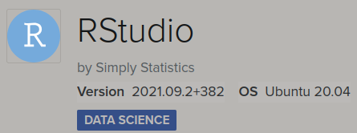

Click `Create RStudio Droplet`.

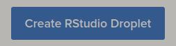

## Configure the settings

**Choose Region:** Select the location closest to you.

**Datacenter:** Leave as default.

**Choose an image:** This should default to the Rstudio by Simply Statistics.

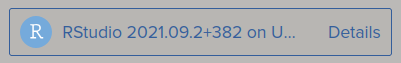

**Choose Size:** Select the specifications you need (options detailed [here](https://docs.digitalocean.com/products/droplets/concepts/choosing-a-plan/)).

> Note: Free trial accounts may need to request access to the Dedicated CPU/Premium CPUs.

**Backups:** Select if needed.

**Choose Authentication Method:** Select the Password method for simplicity. Create a password for your Droplet.

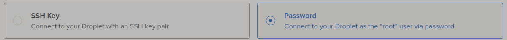

**Finalize Details:** Change the Hostname to help identify your Droplet. Click `Create Droplet`.

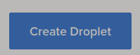

More details on settings [here](https://docs.digitalocean.com/products/droplets/how-to/create/).

## Set up a new user

Under your project, you will see the newly-created Droplet. Note the green dot next to the Hostname indicating it is active. Click your Droplet.

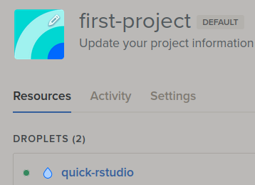

In the top menu bar, note your **ipv4 address**. To the right, click the `Console`.

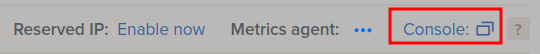

This will open a new window with a console to your Droplet. Look to the bottom for the line `root@{{your-hostname}}:~#`. This is where you will type commands.

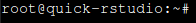

### Console Steps: Add a new user

Enter the following commands into the console.

1. `adduser {{username}}`
2. Enter a new password.
    > Note: The password will not be displayed while typing.
3. It will then ask for some basic info. You can leave them blank by pressing enter. At the end, enter `y` to confirm the info is correct.

## Access RStudio

Open a new browser and type your **ipv4 address** and `:8787` into the URL address bar: `{{your.ipv4.address}}:8787`

This will take you to the RStudio sign in page. Enter the new user credentials you previously created.

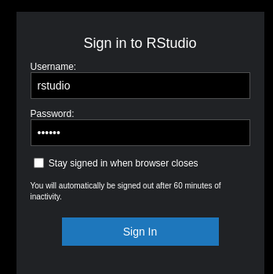

Congrats! You now have access to RStudio.

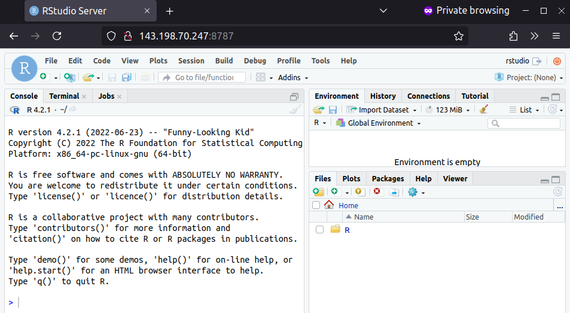

# Manual Setup

Set up a Droplet with RStudio.

## Sign into your account

After creating your DigitalOcean account, sign into it.

## Create the Droplet

From your Projects page, click `Create` and then click `Droplets`.

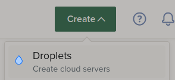

## Configure the settings

**Choose Region:** Select the location closest to you.

**Datacenter:** Leave as default.

**Choose an image:** Unless you need a specific image, leave as default Ubuntu and default version.

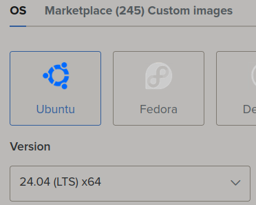

**Choose Size:** Select the specifications you need (options detailed [here](https://docs.digitalocean.com/products/droplets/concepts/choosing-a-plan/)). 

> Note: Free trial accounts may need to request access to the Dedicated CPU/Premium CPUs.

**Backups:** Select if needed.

**Choose Authentication Method:** Select the Password method for simplicity. Create a password for your Droplet.

**Finalize Details:** Change the Hostname to help identify your Droplet. Click `Create Droplet`.

More details on settings [here](https://docs.digitalocean.com/products/droplets/how-to/create/).

## Install R and RStudio

Under your project, you will see the newly-created Droplet. Note the green dot next to the Hostname indicating it is active. Click your Droplet.

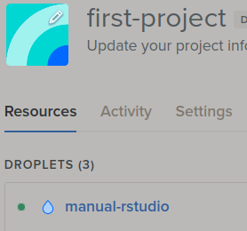

In the top menu bar, note your **ipv4 address**. To the right, click the `Console`.

This will open a new window with a console to your Droplet. Look to the bottom for the line `root@{{your-hostname}}:~#`. This is where you will type commands.

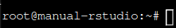

### Console Steps: Install R and  RStudio

> Note: This guide used Ubuntu v. 24.04. Be sure to check the official install instructions [here](https://posit.co/download/rstudio-server/) if you're on a different image/version.
 
Enter the following commands into the console.

1. `sudo apt update`
2. `sudo apt upgrade -y`
3. `sudo apt install r-base -y`
4. `sudo apt install gdebi-core -y`
5. `wget https://download2.rstudio.org/server/jammy/amd64/rstudio-server-2024.09.0-375-amd64.deb`
6. `sudo gdebi rstudio-server-2024.09.0-375-amd64.deb`
   - You will be asked for confirmation. Enter `y` to continue.

> Note: You may receive pop-up windows during the installation process. Leave the default choices and press enter to continue.

The console will display RStudio Server as active. You can check the RStudio Server status with the command: `systemctl status rstudio-server`

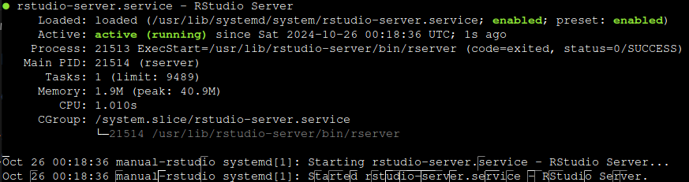

## Last steps

1. See [Console Steps: Add a new user](#console-steps-add-a-new-user).
2. See [Access RStudio](#5-access-rstudio).

# Final Considerations

The following configurations may be useful to work effectively.

## Elevated Privileges

Logging into the Droplet console defaults to `root` user with the highest privileges. In contrast, the new user (from [Console Steps: Add a new user](#console-steps-add-a-new-user)) has limited privileges.

You can elevate the new user's privileges with `sudo`. In the console, and as `root` user, enter the command:

`usermod -aG sudo {{username}}`

Now the new user can temporarily run commands as `root` by typing `sudo` in front of their commands (e.g.,`sudo apt update`).

## Transfer Files

Use `rsync` to transfer large files from your local computer to the Droplet with the command:

`rsync -avzP -e ssh {{/path/to/local/file}} {{username@VM-IP-Address}}:{{/path/to/destination/}}`

Flag meanings:
- `-a`: Archive mode (preserves permissions and directory structure)
- `-v`: Verbose (shows detailed progress)
- `-z`: Compress files during transfer
- `-P`: Shows progress and allows partial transfers to be resumed
- `-e ssh`: Use SSH for encryption

> Note: In case the transfer gets interrupted, just the run the same `rsync` command again and it will resume where it left off.

## Firewalls

It's a good idea to set up a firewall. This helps prevent unauthorized access to your VM.

Navigate to your Droplet. On the left-panel menu, click `Networking`.

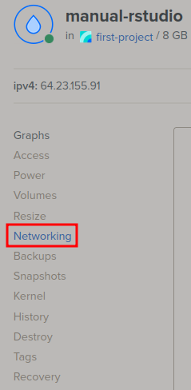

Scroll down to Firewalls, click `Edit`, and `Create Firewall`. This will take you to a page to configure your firewall:

**Name:** Create a name for this firewall.

**Inbound Rules:** Select the `New rule` drop-down and click `Custom`. Change the Port Range to `8787` and then save it.

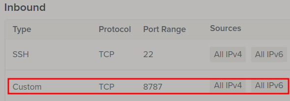

**Outbound Rules:** Leave as default.

**Apply to Droplets:** Select your Droplet and then click `Create Firewall`.