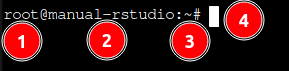
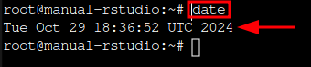
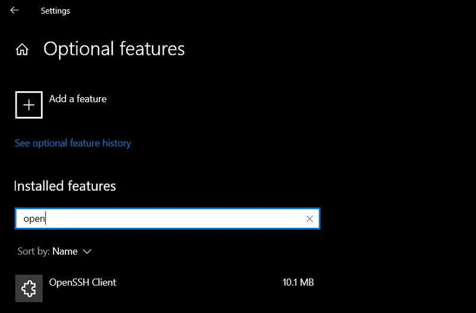

**Table of Contents**
- [Introduction](#introduction)
  - [Primer concepts (optional)](#primer-concepts-optional)
    - [Virtual machine](#virtual-machine)
    - [Linux](#linux)
    - [Command-line interface (CLI)](#command-line-interface-cli)
- [Requirements](#requirements)
- [Quick Setup](#quick-setup)
  - [1. Sign in](#1-sign-in)
  - [2. Create the Droplet](#2-create-the-droplet)
  - [3. Configure the settings](#3-configure-the-settings)
  - [4. Set up a new user](#4-set-up-a-new-user)
  - [5. Access RStudio](#5-access-rstudio)
- [Manual Setup](#manual-setup)
  - [1. Sign in](#1-sign-in-1)
  - [2. Create the Droplet](#2-create-the-droplet-1)
  - [3. Configure the settings](#3-configure-the-settings-1)
  - [4. Install R and RStudio](#4-install-r-and-rstudio)
  - [Last steps](#last-steps)
- [Final Considerations](#final-considerations)
  - [Elevated Privileges](#elevated-privileges)
  - [Transfer Files](#transfer-files)
    - [Windows](#windows)
    - [Mac/Linux](#maclinux)
  - [Firewall](#firewall)

# Introduction

This document shows you how to set up RStudio on a virtual machine (VM). By the end, you will have a computer that can be scaled to your R-programming needs.

The target audience:
- Researchers
- Data scientists
- Lab technicians

Programming in RStudio is beyond the scope of this guide and will not be covered.

## Primer concepts (optional)

The following are useful concepts and terms to understand this document.

### Virtual machine

A physical computer (usually in a remote location) that *virtually* divides and allocates its computing resources (i.e., CPU, RAM, memory, etc.). Each allocation is a VM that can run its own operating systems and applications. Users can access the VM through the internet and easily increase/decrease its computing resources.

### Linux

A collection of operating systems. Many VM providers offer Linux as a popular option. Different "versions" of Linux are known as distributions. We will use the [Ubuntu](https://en.wikipedia.org/wiki/Ubuntu) distribution.

### Command-line interface (CLI)

A program used to enter text-only commands to a computer. Commands are typed out and the computer outputs the results.

The following is a typical Linux command-line interface display:

1. The user who is logged into the computer - in this example `root`.
2. The name of the computer - in this example `manual-rstudio`.
3. The current directory - in this example `~` (which denotes the user's home directory).
4. The area to type commands.

The following shows a typical Linux command input and its resulting output:

1. The command `date` is typed and entered.
2. The output is `Tue Oct 29 18:36:52 UTC 2024`.

# Requirements

- A computer with internet access
- A [DigitalOcean account](https://try.digitalocean.com/freetrialoffer/)

We will use DigitalOcean as our VM provider. They offer a free trial and have pre-configured VMs ready to use. DigitalOcean calls their VMs ["Droplets"](https://docs.digitalocean.com/products/droplets/).

> Note: Double curly brackets `{{}}` denote placeholders for *your* values.

# Quick Setup

Steps to set up a pre-configured Droplet that includes RStudio.

## 1. Sign in

[Log in](https://cloud.digitalocean.com/login) to your DigitalOcean account.

## 2. Create the Droplet

Select the pre-configured Droplet: [RStudio by Simply Statistics](https://marketplace.digitalocean.com/apps/rstudio).

Click `Create RStudio Droplet`.

## 3. Configure the settings

- **Choose Region:** Select the location closest to you.
- **Datacenter:** Leave the defaults.
- **Choose an image:** Select Rstudio by Simply Statistics.

- **Choose Size:** Select the specifications you need. [Click here](https://docs.digitalocean.com/products/droplets/concepts/choosing-a-plan/) for more specifications details.

> Note: Free trial accounts may need to request access to the Dedicated CPU/Premium CPUs.

- **Backups:** Select if needed.
- **Choose Authentication Method:** Select the Password method for simplicity. Create a password for your Droplet.

- **Finalize Details:** Change the Hostname to help identify your Droplet. Click `Create Droplet`.

[Click here](https://docs.digitalocean.com/products/droplets/how-to/create/) for more settings details.

## 4. Set up a new user

Navigate to your Projects dashboard. Your newly-created Droplet is shown. Click your Droplet.

Make note of your **ipv4 address** in the top menu bar. To the right, click `Console`.

A [CLI](#command-line-interface) window pops up. Look to the bottom for the line `root@{{your-hostname}}:~#`.

Enter the following command into the CLI:

`adduser {{username}}`

Follow the output instructions:
1. Enter a new password.
    > Note: The password is not displayed while typing.
2. Enter the basic information or leave as "blank" to skip.
3. Enter `y` to confirm the information.

## 5. Access RStudio

Open a new browser on your local computer. Enter your **ipv4 address** and `:8787` into the URL address bar. It should look like: 

`{{your.ipv4.address}}:8787`

Enter your new user credentials into the RStudio sign in page.

Congrats! You now have access to RStudio.

# Manual Setup

Set up a Droplet with RStudio.

## 1. Sign in

[Log in](https://cloud.digitalocean.com/login) to your DigitalOcean account.

## 2. Create the Droplet

Navigate to your Projects dashboard. Click `Create` and then `Droplets`.

## 3. Configure the settings

- **Choose Region:** Select the location closest to you.
- **Datacenter:** Leave the defaults.
- **Choose an image:** Leave the defaults [Ubuntu](#linux) and its version.

- **Choose Size:** Select the specifications you need. [Click here](https://docs.digitalocean.com/products/droplets/concepts/choosing-a-plan/) for more specifications details.

> Note: Free trial accounts may need to request access to the Dedicated CPU/Premium CPUs.

- **Backups:** Select if needed.
- **Choose Authentication Method:** Select the Password method for simplicity. Create a password for your Droplet.

- **Finalize Details:** Change the Hostname to help identify your Droplet. Click `Create Droplet`.

[Click here](https://docs.digitalocean.com/products/droplets/how-to/create/) for more settings details.

## 4. Install R and RStudio

Navigate to your Projects dashboard. Your newly-created Droplet is shown. Click your Droplet.

In the top menu bar, note your **ipv4 address**. To the right, click the `Console`.

A [CLI](#command-line-interface) window pops up. Look to the bottom for the line `root@{{your-hostname}}:~#`.

> Note: We used Ubuntu version 24.04 at the time of writing. Be sure to check the [official install instructions](https://posit.co/download/rstudio-server/) if you are on a different image/version.

Enter the following commands into the CLI:

1. `sudo apt update`
2. `sudo apt upgrade -y`
3. `sudo apt install r-base -y`
4. `sudo apt install gdebi-core -y`
5. `wget https://download2.rstudio.org/server/jammy/amd64/rstudio-server-2024.09.0-375-amd64.deb`
6. `sudo gdebi rstudio-server-2024.09.0-375-amd64.deb`
   - Enter `y` to continue.

> Note: A pop-up window may appear during installation asking for configuration settings. Leave the default choice and press enter to continue.

The CLI displays RStudio Server as active. You can always check the status with the command:

`systemctl status rstudio-server`

## Last steps

1. See section [Set up a new user](#4-set-up-a-new-user).
2. See section [Access RStudio](#5-access-rstudio).

# Final Considerations

The following may be useful to work effectively.

## Elevated Privileges

Logging into the Droplet console defaults to `root` user with the highest privileges. In contrast, the new user (from [Console Steps: Add a new user](#console-steps-add-a-new-user)) has limited privileges.

You can elevate the new user's privileges with `sudo`. In the console, and as `root` user, enter the command:

`usermod -aG sudo {{username}}`

Now the new user can temporarily elevate its privileges by typing `sudo` in front of their commands (e.g., `sudo apt update`).

## Transfer Files

Below are a few ways to transfer files to your Droplet depending on your local computer's operating system.

### Windows

**WinSCP**

A graphical user interface tool.

1. [Download it](https://winscp.net/eng/index.php)
2. [Connect to your Droplet](https://winscp.net/eng/docs/guide_digitalocean)
3. [Transfer files](https://winscp.net/eng/docs/guide_upload)

**OpenSSH**

A command line tool.

> Note: Requires Windows 10 (build 1809 or later) and [PowerShell (5.1 or later)](https://learn.microsoft.com/en-us/powershell/scripting/install/installing-powershell-on-windows?view=powershell-7.4)

Enable OpenSSH [with PowerShell](https://learn.microsoft.com/en-us/windows-server/administration/openssh/openssh_install_firstuse?tabs=powershell&pivots=windows-server-2025#enable-openssh-for-windows-server-2025) or:

1. From the Start menu, search and open "optional features"
2. Click "Add a feature"
3. Search "OpenSSH Client" and click install

Transfer files by running the following command in your local terminal:

`scp {{C:\path\to\local\file}} {{username}}@{{vm.ip.address}}:{{/path/to/remote/directory}}`

> Note: Windows uses backslashes `\` while Mac/Linux uses forward slashes `/`.

### Mac/Linux

**rsync**

A command line tool.

Transfer files by running the following command in your local terminal:

`rsync -avzP -e ssh {{/path/to/local/file}} {{username}}@{{vm.ip.address}}:{{/path/to/remote/directory/}}`

Flag meanings:
- `-a`: Archive mode (preserves permissions and directory structure)
- `-v`: Verbose (shows detailed progress)
- `-z`: Compress files during transfer
- `-P`: Shows progress and allows partial transfers to be resumed
- `-e ssh`: Use SSH for encryption

> Note: In case the transfer gets interrupted, just the run the same `rsync` command again and it will resume where it left off.

## Firewall

A firewall helps secure your VM.

Navigate to your Droplet. On the left-panel menu, click `Networking`.

Scroll down to Firewalls, click `Edit`, and `Create Firewall`. This will take you to a page to configure your firewall:

**Name:** Create a name for this firewall.

**Inbound Rules:** Select the `New rule` drop-down and click `Custom`. Change the Port Range to `8787` and then save it.

**Outbound Rules:** Leave the defaults.

**Apply to Droplets:** Select your Droplet and then click `Create Firewall`.