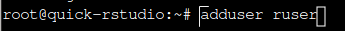
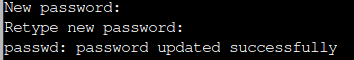
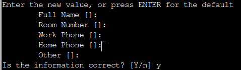

# RStudio on a Virtual Machine

This is a guide to set up RStudio on a Virtual Machine ("VM"). The goal is to provide a computer capable of running analysis on large datasets.

# Requirements

- A computer with internet access
- [DigitalOcean account](https://try.digitalocean.com/freetrialoffer/)

We will use DigitalOcean as our VM provider. They offer a free trial and have pre-configured VMs ready to use. DigitalOcean calls their VM service "Droplets".

# Quick Setup

We will use a pre-configured Droplet found in the [Marketplace](https://marketplace.digitalocean.com/).

## 1. Sign into your account

After creating your DigitalOcean account, sign into it.

## 2. Create the Droplet

Navigate to the pre-configured Droplet: [RStudio](https://marketplace.digitalocean.com/apps/rstudio) by Simply Statistics.

Click `Create RStudio Droplet`.

## 3. Configure the settings

**Choose Region:** Select the location closest to you.

**Datacenter:** Leave as default.

**Choose an image:** This should default to the Rstudio you previously clicked in step 3.

**Choose Size:** Select the specifications you need (options detailed [here](https://docs.digitalocean.com/products/droplets/concepts/choosing-a-plan/)). Note free trial accounts may need to request access to the Dedicated CPU/Premium CPUs.

**Backups:** Select if needed.

**Choose Authentication Method:** Select the Password method for simplicity. Create a password for your Droplet.

**Finalize Details:** Change the Hostname to help identify your Droplet. Click `Create Droplet`.

More details on settings [here](https://docs.digitalocean.com/products/droplets/how-to/create/).

## 4. Set up a RStudio user

Under your project, you will see the newly-created Droplet. Note the green dot next to the name indicating it is active. Click your Droplet.

In the top menu bar, note your **ipv4 address**. To the right, click the `Console`.

This will open a new window with a console into your Droplet. It will load general system information which can be ignored. Look to the bottom for the line `root@<your-hostname>:~#`. This is where you will type commands.

Set up a new RStudio user:

1. Type `adduser <username>` and press enter.
    
2. Type the RStudio user's password and press enter. Note the password will not be displayed while typing.
    
3. It will then ask for some basic info. You can leave them blank by pressing enter. At the end, type `y` and press enter to confirm the info is correct.
    

## 5. Access RStudio

Open a new browser and type your **ipv4 address** and `:8787` into the URL address bar: `your.ipv4.address:8787`

This will take you to the RStudio sign in page. Enter the credentials you created in step 4.

Congrats! You should now have access to RStudio.

